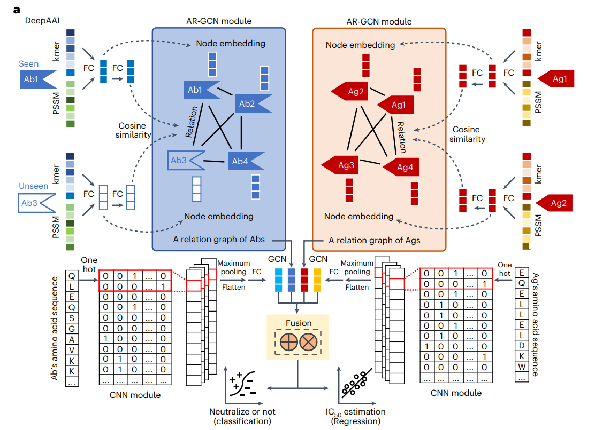
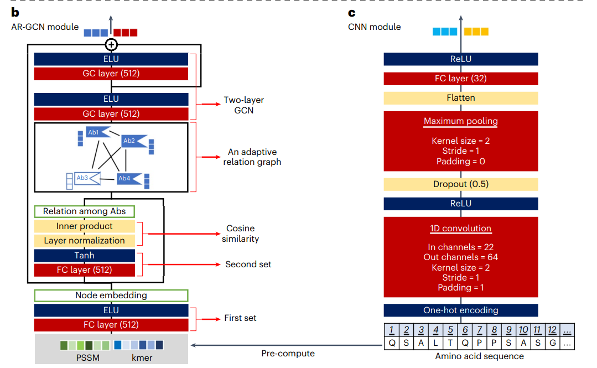

# DeepAAI

* paper：https://www.nature.com/articles/s42256-022-00553-w

****

## Keywords

* neutralization effects：中和作用

* opsonize：调理（针对细菌感染，治疗）
* antibody(Abs)：抗体
* antigen(Ags)：抗原

## Background

### Interdisciplinary

* 人体中有大量Abs，但仅有少量被证明可调理或中和病毒，大量的作用未知（不可见，unseen）
* 传统实验方法耗时耗力，需要计算机方法快速准确地处理Abs
* opsonize和neutralize的不同点：
  * opsonize是间接的抗病毒过程，抗体结合病原体作为标记，促进巨噬细胞对其进行吞噬
  * neutralize是直接的抗病毒过程，直接组织病原体连接到宿主

### Type

* 依据**任务**分类Ab-Ag相互作用的相关工作：
  * 预测Ab-Ag结合位点（binding sites）
  * 区分Ab-Ag结合物/非结合物
  * 预测Ab-Ag的中和作用/非中和作用
* 依据**输入**分类：
  * 基于序列（sequence）的输入
    * 结合局部领域和整体序列，对Ab-Ag residues（残基）进行跨模态attn
  * 基于结构（structure）的输入
    * 将图卷积网络（GCNs）用于Ab和Ag结构，通过点云提取几何特征

### Challenge

* 冷启动问题，不可见Abs和任意Ag的中和作用未知：
  * 已有方法：从已有的**抗体-抗原相互作用关系**中学习**抗体表征**
  * 由于缺少不可见的抗体的相互作用关系，故不适合

* 用静态特征去表示Abs和Ags，表达性和适应性可能会收到限制：由于表征空间可能是多维且预先算好的，故该过程无监督，并未优化

## Abstract

* DeepAAI：
  * 目的：获取抗体表征
  * 关注点：Ab-Ag neutralization
  * 方式：
    * 构造2个抗体与抗原之间的自适应关系图
    * 对可见和不可见的抗体表征使用Laplacian smoothing
  * 表现：
    * 在人类免疫缺陷病毒、严重急性呼吸综合征冠状病毒、流感和登革热上的表现得到了证明
    * 具有可解释性

* **抗体关系图：表现抗体中和作用的相似性**
* **抗原关系图：表现病毒不同变体（variants）之间的关系**

* 由于氨基酸序列易获取，且大规模序列数据可以提高方法的适用性：本文使用基于氨基酸序列的输入

## Method

### Adaptive Relation Graph

* 构建2个抗体与抗原之间的自适应关系图
  * 结构：
    * 节点：Abs 和 Ags
    * 节点属性：Abs和Ags的表征
    * 边权：Abs 之间或 Ags 之间的量化联系

* 输入降维

* 权值可动态优化：
  * 权值包括：点权和边权
  * 面向任务，预测最佳关系

****

### Applying GCNs & Laplacian smoothing

* Laplacian smoothing：在可见Abs表征和不可见Abs表征之间
* 在训练过程中，可以从关联的可见ab的表示中学习未知ab的表示，并对其进行优化，保证了未知ab的中和性可以半监督地推断出来
* 关注**全局和局部**：
  * 全局：Abs和Ags相互作用的确定性 --->  adaptive relation graph
  * 局部：在表面的氨基酸直接影响（Abs和Ags间）的亲和力（affinity）----->  CNN

****

## Appendix

### ELU

$$
\text{ELU}(x) = 
\begin{cases} 
x & \text{if } x > 0 \\
\alpha (\exp(x) - 1) & \text{if } x \leq 0
\end{cases}
$$

* $ \alpha $ 往往默认为1
* 特点：
  * **避免神经元死区**：与 ReLU（Rectified Linear Unit）不同，ELU 在输入小于零时仍有输出，这可以避免 ReLU 中的神经元死区问题（即输入始终为负时，梯度为零，神经元无法更新）
  * **带有负值的平滑输出**：ELU 的负值部分是平滑的指数函数，这可以使模型在训练时更稳定，并加速收敛
  * **零均值特性**：ELU 在输入均匀分布时，输出均值更接近于零，这有助于降低偏置偏差，从而提高模型的性能

​	

