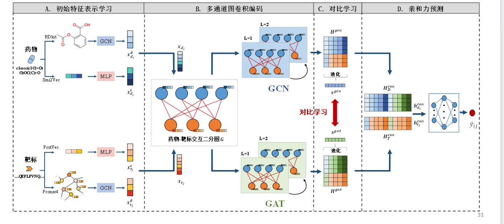

## Method

### 局部特征

* MLP、transformer
* 关注点信息

### 全局特征

* GCNs，GATs
* 关注图结构信息

### 对比学习

* 模态对齐

### 图类型

* 使用GCN和GAT时，往往使用同构图，可否使用异构图？

## Structure

## Models

### MLP

* 多层感知机

* 前馈人工神经网络，包含：
  * 输入层
  * 隐藏层：全连接
  * 输出层

### GATs

* 图注意力机制，具体于GATs.md

### GCNs

* 图卷积网络，具体于GCNs.md

