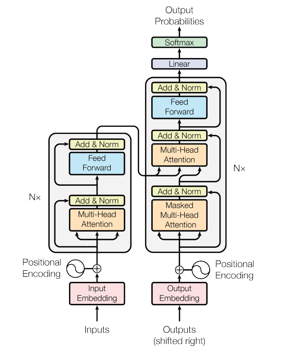

# Transformer 代码分析 Model



## Encoder & Decoder：

* 初始化各层：

```python
c = copy.deepcopy
attn = MultiHeadedAttention(h, d_model).to(DEVICE)
ff = PositionwiseFeedForward(d_model, d_ff, dropout).to(DEVICE)
position = PositionalEncoding(d_model, dropout).to(DEVICE)
```


* 实例化Transformer：

```python
model = Transformer(
        Encoder(EncoderLayer(d_model, c(attn), c(ff), dropout).to(DEVICE), 							N).to(DEVICE),
        Decoder(DecoderLayer(d_model, c(attn), c(attn), c(ff), dropout).to(DEVICE), 				N).to(DEVICE),
        nn.Sequential(Embeddings(d_model, src_vocab).to(DEVICE), c(position)),
        nn.Sequential(Embeddings(d_model, tgt_vocab).to(DEVICE), c(position)),
        Generator(d_model, tgt_vocab)).to(DEVICE)
```


### Encoder:

* 调用`EncoderLayer`，复制N次（连续 encode N次）
* 调用`LayerNorm`


### EncoderLayer：

* 调用`MultiHeadedAttention`，存在维度变化
* 调用`FeedForward`，
* 调用`SubLayerConnection`，残差连接，无维度变化
* 调用`LayerNorm`，无维度变化

****

* 代码（仅维度发生变化的部分）：

  * EncoderLayer中：

  ```python
  x = self.sublayer[0](x, lambda x: self.self_attn(x, x, x, mask)) 
  
  return self.sublayer[1](x, self.feed_forward)
  ```

  * Multi-Head中：

  ```python
  // q, k, v
  query, key, value = [l(x).view(nbatches, -1, self.h, self.d_k).transpose(1, 2)
                               for l, x in zip(self.linears, (query, key, value))]
  
  // attention
  x, self.attn = attention(query, key, value, mask=mask, dropout=self.dropout)
  
  // concat
  x = x.transpose(1, 2).contiguous().view(nbatches, -1, self.h * self.d_k)
  ```

  * attention中：

  ```python
  // scores:
  scores = torch.matmul(query, key.transpose(-2, -1)) / math.sqrt(d_k)
  
  // p_attn:
  p_attn = F.softmax(scores, dim=-1)
  
  // value:
  return torch.matmul(p_attn, value), p_attn
  ```

#### （Multi-Head + Add&Norm）

* 维度变化：
  * input：`[batch_size x F x d_model]` :  [32 x ? x 512]
  * Multi-Head：
    * input: `[batch_size x F x d_model]` : [32 x ? x 512]
    * view:  `[batch_size x F x h x d_k]`: [32 x ? x 8 x 64]
    * transpose: `[batch_size x h x F x d_k]`: [32 x 8 x ? x 64]
    * attentioin: 
      * query: [32 x 8 x ? x 64]   /   key: [32 x 8 x 64 x ?]
      * scores: [32 x 8 x ? x ?]
      * p_attn: [32 x 8 x ? x ?]
      * output: matmal(p_attn, value) ,  [32 x 8 x ? x 64]
  * concat: 
    * transpose: `[batch_size x F x h x d_k]`: [32 x ? x 8 x 64]
    * view: `[batch_size x F x d_model]`: [32 x ? x 512]


#### (FeedForward + Add&Norm)

* 维度变化：
  * input:  `[batch_size x F x d_model]`: [32 x ? x 512]
  * feed_forward: 
    * 第一次线性变换：`[batch x F x d_ff]`: [32 x ? x 2048]
    * 第二次线性变换：`[batch x F x d_model]`: [32 x ? x 512]

****

### Decoder & DecoderLayer：

* Decoder和Encoder类似
* DecoderLayer与EncoderLayer的不同在于：增加了一层attention，Context-Attention
  * context-attention概括上下文
  * context-attention的q为decoder hidden，而k和v为encoder hidden
    * 我理解为：用decoder的输入去比较上下文，得出需要pay attention的部分

****

* 代码：

```python
# Self-Attention：注意self-attention的q，k和v均为decoder hidden
x = self.sublayer[0](x, lambda x: self.self_attn(x, x, x, tgt_mask))

# Context-Attention：注意context-attention的q为decoder hidden，而k和v为encoder hidden
x = self.sublayer[1](x, lambda x: self.src_attn(x, m, m, src_mask))

# FeedForward
return self.sublayer[2](x, self.feed_forward)
```

## Embeddings:

* 作用：将整数索引映射到密集向量（即：嵌入向量）
* 参数：
  * `num_embeddings`：嵌入层的大小，即嵌入向量的数量。这通常等于类别的数量，例如词汇表的大小
  * `embedding_dim`：嵌入向量的维度

****

* 代码：

```python
# self.lut为嵌入层
# 乘以math.sqrt(d_model)：防止嵌入向量的值过小，导致模型在训练初期的梯度过小
res = self.lut(x) * math.sqrt(self.d_model)
```

****

* 维度变化：
  * input：`[batch_size x F]` : [32 x ?]
  * output: `[batch_size x F x d_model]`: [32 x ? x 512]