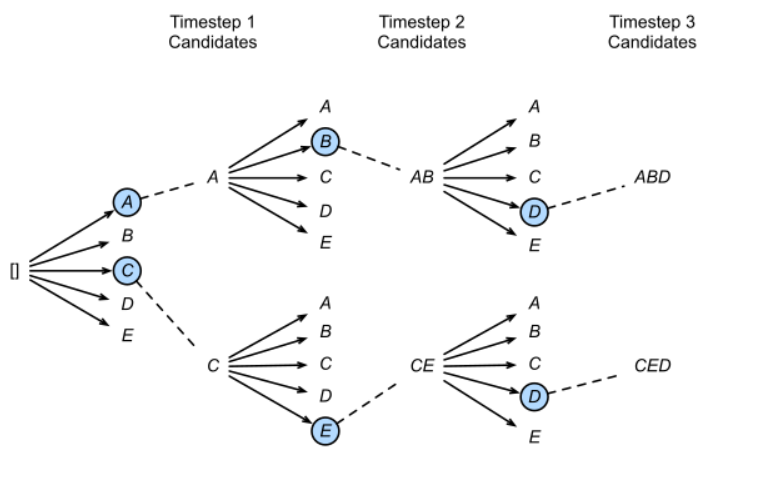

# Transformer 代码分析： beam

****

## Beam Search：

* 相比于greedy search的方法，beam search在每一步解码处保留前K个可能结果，将k个结果传入下一步，在下一步再产生k个可能结果
* 图示：

****

## Advance：

`advance` 函数是 Beam Search 算法的核心部分，它负责更新 Beam 的状态并检查是否已完成搜索。

具体来说，`advance` 函数接收一个参数 `word_logprob`，这是一个张量，表示当前时间步每个词的对数概率。然后，它计算每个候选序列的得分（即前一时间步的得分加上当前时间步的对数概率），并从中选择得分最高的 `size` 个序列作为新的候选序列。

这个函数的主要步骤如下：

1. 如果 `self.prev_ks` 不为空（即不是在初始步骤），则将 `self.scores`（前一时间步的得分）与 `word_logprob` 相加，得到每个候选序列的得分。否则，直接使用 `word_logprob[0]` 作为初始得分。
2. 将得分张量 `beam_lk` 展平为一维张量 `flat_beam_lk`，然后使用 `topk` 函数找出得分最高的 `self.size` 个元素，这些元素对应的序列就是新的候选序列。
3. 将 `self.scores` 更新为新的候选序列的得分，并将这些得分添加到 `self.all_scores` 中。
4. 计算每个新的候选序列对应的前一时间步的序列的索引 `prev_k`，并将其添加到 `self.prev_ks` 中。

这个函数的结果是，`self.scores`、`self.prev_ks` 和 `self.all_scores` 都被更新了，以反映新的候选序列的信息。