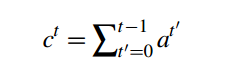

# Get to The Point: Pointer-Generator Network

## 问题：

* 神经网络的seq2seq模型提供了抽象文本摘要的一种方法，但存在2个缺点：
  * 再现事实细节不准确
  * 重复

## 背景：

### Summarization技术：

* **Task**：总结、概括
* **Methods**：
  * extractive（抽取）：直接取自源文本：**简单、能保证基本的语法正确性和答案准确性**
  * abstractive（抽象）：生成新单词和短语：**能实现意译、概括、引入知识**

* **History：**
  * 曾经多为抽取，现在为抽象
* **Current：**
  * 神经网络（rnn）具有读取文本并自由生成的能力，使其可以进行抽象
  * **存在问题：再现事实细节不准确 & 无法处理OOV（out of vocabulary）词汇 & 重复**

## 介绍：

### 概述：

* 通过 **pointer-generator network** 来促进对原文词组的复制
  * 使用`覆盖向量(coverage vector)`的新变体，用于追踪并控制对原文的控制情况
    * 有效消除了重复的问题

* **longer-text** summarization：本文趋向生成较长的总结
  * 需要更难的抽象能力以及防止重复信息的能力，因此较难，但最终会更实用
* 使用新闻业的Dataset：新闻数据集往往包含中等长度的文章以及相应的多句总结

> Problems:
>
> 1. coverage vector
> 2. Lstm

****

### Models:

#### Seq2Seq attentional model:

* 基础结构：

  * `w_i`(input)：文章的tokens逐个输入encoder（单层、双向的LSTM）
  * `h_i`：a sequence of **encoder hidden states**
  * `s_t`：decoder产生的输出decoder state

  > hidden states:
  >
  > * 即为lstm的输出

* 计算**注意力分布（attention distribution）**：

  * attn机制：
    * encoder得到hidden state
    * 输入decoder，decoder得到s_t
    * 以s_t作为query，获得当前q应该对原文的哪部分pay attention，得到attention

  * 公式：

  

  * `v、W_h、W_s、b_attn`是可学习参数

* 计算**context vector**：

  * 上下文向量，可理解为可表示当前step所阅读内容的定长向量
  * 用attention处理hidden state
  * 公式：

  

* 计算**vocabulary distribution**：

  * 词表概率分布，即词表中所有词的概率分布
  * 公式：

  

  * `V, V', b, b'` ：为可学习参数

****

#### Pointer-generator network:

* 该模型同时考虑2种总结生成方式：
  * generate：依据上一步所得的词表中词的概率分布P_vocab，通过生成来总结
  * copy：依据attention，通过复制来总结
* **P_gen**
  * **generation possibility**
  * 通过context vector、decoder state、decoder input，计算**generation possibility**
  * 公式：

​			（注：可学习参数：3个权重矩阵+b_ptr）

* 最终概率公式：

* 解释：
  * **加权**：对于生成概率较大的词汇，评判该词汇应更看重生成；反之，对于生成概率较小的词汇，评判该词汇应更看重直接copy
  * **解决OOV问题**：当输入w为OOV时，P_vocab为0，此时考虑直接copy

****

#### Coverage Mechanism:

* 解决总结中的重复问题

* 计算**coverage vector** c^t：

  * 对之前的timesteps的注意力分布求和，表示迄今为止原文中词汇的注意力机制覆盖程度
  * 公式：

  

* 依据coverage vector，修改注意力机制的计算方式，公式：

* 可学习参数w_c
* 关于coverage loss：
  * 对注意力分布和已覆盖范围的重叠情况进行惩罚，在使用超参加权后，加入loss函数中
  * 由于summarize问题的特殊性，无需考虑机器翻译中的一致性问题

## Experiment：

### Metric：

* ROUGE：自动文摘的凭借标准，同时考虑准确率和召回率（查全率）
* METEOR：文本生成评价指标，在考虑准确率和召回率的基础上：
  * 结果基于语料库：统计绝对一致词共现、词语变体共现、同义词共现（WordNet词典）
  * 考虑词序，产生罚分

### Train:

* pointer-generator训练速度较baseline model快，尤其在起始阶段
* 添加coverage机制：
  * 在训练时分为不同阶段：先在无coverage情况下训练，再加入coverage训练（且该方法较在开始时即加入coverage的方式，有更佳的表现）
  * 关于loss weight：设置为1（将loss由0.5降到0.2），不使用2（虽然减少coverage loss，但增大了初始loss）

### Dicussion about Result：

* 与 extractive systems 相比较：上表显示抽取机制更有可能得到高ROUGE
  * 大部分文章会存在总结性语句，且一般集中在前部
  * ROUGE存在不合理性：偏向于safe strategy，使得抽取机制获利

## Last:

* 本文重点在于P_gen，其不仅可以使模型同时从abstractive和extractive两个角度考虑，也可以作为判断summarization抽象性的评判标准
  * P_gen值在训练过程中是从小到大的，所以开始时模型是在copy，然后学会了generate
* 相比于单纯的抽象，虽然该模型的创新性降低，但结果更佳:

