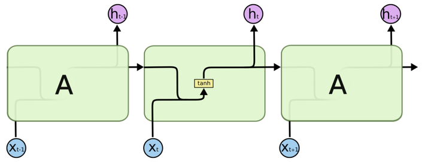
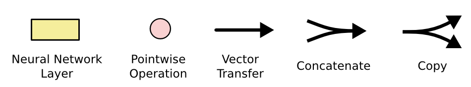
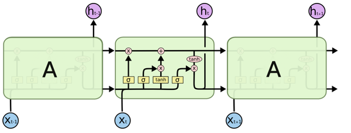
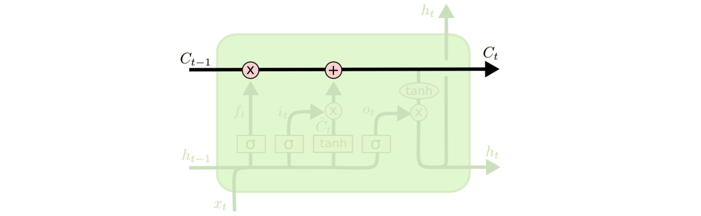
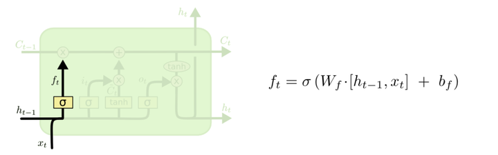
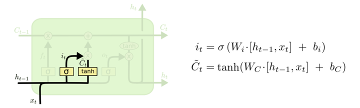
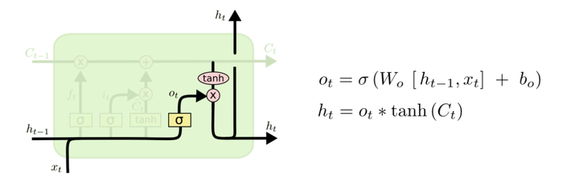

# LSTM

## Abstract：

* LSTM：long short term memory
* 存在问题：解决递归神经网络（RNN）的长期依赖问题
  * 长期依赖问题：递归神经网络只能处理我们需要较接近的上下文的情况，即网络只能从距离近的上下文获取信息，无法从距离远的上下文获取信息
* LSTM机制：
  * 记录需要记住的长期记忆
  * 神经网络的记忆处理机制：依据记忆的价值，选择是否遗忘
* 作用：
  * 可以有效地传递和表达长时间序列中的信息并且不会导致长时间前的有用信息被忽略
  * 解决梯度消失、梯度爆炸
* Reference：
  * [LSTM - 长短期记忆递归神经网络 - 知乎 (zhihu.com)](https://zhuanlan.zhihu.com/p/123857569)
  * [双向LSTM-CSDN博客](https://blog.csdn.net/qq_36696494/article/details/89028956)

## 结构：

### background：rnn：

****

### background：representation method：

* Neural Network：神经网络层
* Pointwise Operation：操作（向量和等）

****

### LSTM：

#### 细胞状态传递（“记忆传递”）：

* C_{t-1}：传入之前的细胞状态
* 通过与遗忘向量相乘，得到该细胞需要记住的部分
* 再加上当前细胞状态
* 传给下一细胞

#### 遗忘门：

* 依据上一刻的输出和当前的输入，决定丢弃的信息
* 使用`sigmoid`函数，产生(0, 1)之间数值，决定遗忘的程度

#### 记忆门：

* 使用`tanh`提取输入中的有效信息
* 使用`sigmoid`决定哪些信息需要记住

#### 输出门：

* 使用`tanh`处理当前细胞状态，得到一个在 -1 到 1 之间的值
* 使用`sigmoid`层选择当前细胞状态需要向后输出的部分

## Conclusion:

* 我的理解：
  * 记忆传递的水平线：传递完整的记忆（各个细胞状态集合）
  * 输出h_t：依据当前细胞状态（当前的完整记忆），结合当前的输入与上一步输出，做出这一步的输出选择