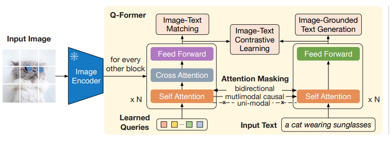
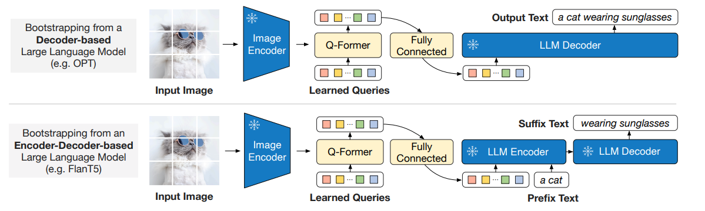

# BLIP-2

* Bootstrapping Language-Image Pre-training with frozen unimodal models

## Introduction

### Keys：

* 单模态模型在预训练阶段 frozen

>  To reduce computation cost and counteract the issue of catastrophic forgetting, the **unimodal pre-trained models remain frozen during the pre-training.**

* 将完成预训练的单模态模型用于VLP，重点是促进多模态对齐

* LLMs在训练时处于freezing状态，并没有看到图片，这使对齐难度大
  * 之前的方法：image-to-text generation loss, insufficient to bridge the modality gap

### Q-Former:

****

* Querying Transformer
* **two-stage** pre-training strategy
  * vision-language representation learning：Q-Former学习与文本最相关的视觉表征
  * pre-training：通过连接Q-Former的输出与frozen LLM，训练Q
* lightweight
* employs a set of **learnable query vectors** to **extract visual features** from the frozen image encoder

* between image encoder and LLM：从image encoder中提取重要信息，输入LLM

### others：

* frozen unimodel & lightweight Q-Former使该模型有高于state-of-the-arts的计算效率

## Method

### Model Architecture（Q-Former）:

* 作用：从图像中提取固定数量的特征
* 构成：2个共享相同 self-attention 层的 transformer
  * image transformer：与image encoder部分互动，提取视觉特征
  * text transformer：text encoder & decoder

* About **Learned Queries**：

> Learned Queries：
>
> * 通过可学习的queries，从视觉模型提取信息

> 这些Learned Queries被生成后，作为image encoder的输出，queries与模型其它部分的互动形式：
>
> *  interact with **each other**：**self-attention layers**
> *  interact with **frozen image features**： **through cross-attention layers** 
> * interact with **text**：**the same self attention layers**，该文通过在预训练过程中使用不同的 self-attention masks 来控制 query-text interaction

****

### Vision-Language Representation Learning

* 借鉴BLIP，在学习过程中**共同优化**三个预训练目标，它们的**输入格式和模型参数相同**

  * 三个预训练使用不同的 attention masking strategy：

  

  > problem：理解原理，不理解实现。训练时黑盒模型，难道去规定了bp的区域？

#### ITC：Image-Text Contrastive Learning

* 学习目标：对齐（align）image representation 和 text representation，使图像与文本间的互信息最大化

* 实现：对比学习，比较 positive pair 和 negative pair
* Uni-modal Mask：防止信息泄露，使queries和text无法看到彼此

#### ITG：Image-grounded Text Generation

* 学习目标：输入图片，生成文本
* 由于Q-Former不允许image encoder直接影响text tokens，故：文本生成所需的信息需先通过queries提取到共有的self-attention中，再被text使用

> problem：2个transformer怎么合作

* Multi-modal Causal Mask：
  * text可完全访问query，query不可访问text
  * text仅能访问之前的query

#### ITM：Image-Text Matching

* 学习目标：细粒度的图像文本对齐，二分类任务，判断图像与文本是否匹配
* bi-directional mask：query和text可相互访问

### Vision-to-language generative pre-training

