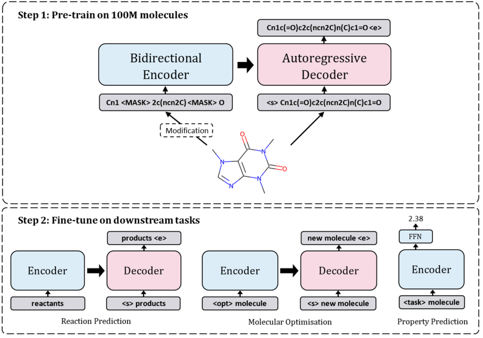

# Chemformer:

****

## Abstract:

*  Transformer模型+SMILES技术
* 现存问题：
  * 模型仅能解决单一问题
  * 训练困难

* Chemformer：
  * 优势：自监督预训练模型**提高性能**，加速在下游任务的应用
  * 可应用于逆合成任务

## Introduction:

* 预训练机制的优势：
  * 在大型未标记的文本数据集上进行训练可改善下游任务，特别是在微调数据量有限的情况下
  * 有效减少微调时间，可以实现更广泛的下游任务超参数调参等需要计算资源的工作

* Transformer的优势：
  * encoder、decoder分离，计算资源需求降低
  * 在预训练完成后，下游任务取权重矩阵，进行微调

### pre-training：

* 将分子转为非规范的SMILES表达式
* 对SMILES字符串进行随机修改(modify)、标记(tokenize)并嵌入(embed)到向量序列中
* 添加 positional embeddings
* 输入**encoder**
* 输入**decoder**，还原SMILES
* 将结果输入线性激活的全连接层，输出模型词表的概率分布
* 计算loss，进行训练

* modification techniques：
  * masking：span masking algorithm，区别于bert的随机mask，该方法：每轮依据几何分布确定span的长度L，对连续L个token进行mask
  * augmentation：利用SMILES特点（一个分子可能对应多个SMILES表示），重新排序原子产生不同的表达
  * combined：先aug，再mask

### Seq2Seq fine-tuning：

* 3个downstream seq2seq tasks：
  * direct synthesis prediction：直接合成
  * retrosynthesis prediction：逆合成
  * molecular optimisation：分子优化

* 微调方法：与pre-training类似

## Results：

* 规模：

* 证明transfer learning优势，比较预训练方法：
  * 注：retro的epoch数是最大的，高达500

* 证明预训练加快retro收敛速度(convergence speed)：
  * Combined经过较少的epochs训练，即可达到SOTA

* 逆合成：包含Chemformer和Chemformer-Large的多种模型比较
  * Chem：500 epochs；Large：200 epochs

### 关于Augmentation Probability：

* 含义：被数据增强的概率

>p_aug = 0.5:
>
> means that by default, they will be applied to 50% of instances of input data
>
>reference: [Setting probabilities for transforms - Albumentations Documentation](https://albumentations.ai/docs/getting_started/setting_probabilities/)

* 从b可以看出：p_aug越大，产生重复分子的可能性就越大，导致beam输出的多样性降低
* 输出多样性的降低又导致了Top-5、Top-10准确率的下降