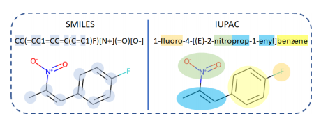

# Multilingual Molecular Representation Learning via Contrastive Pre-training
## Abstract:

* 基于SMILES原理，设计MM-Deacon（multilingual molecular domain embedding analysis via contrastive learning) 
  * 一种：多语言分子嵌入生成法

## Introduction：

### background：

* 药物研发的早期阶段需要考虑无数化合物，耗时耗力

  * 计算机辅助通过自动化多种cheminfomatic任务，**减少消耗**

* 传统方法，如fingerprint generation严重依赖于基于分子图的分子片段层操作（fragment-level operation）

  * 特点：在每个原子上使用固定的二进制哈希函数（fixed binary hash function）
  * 缺点：**关注局部特点，可能无法捕捉到总体特点**
  * 如：Morgan fingerprint

* SMILES的局限性：

  

  * 有机化学物是被系统命名的：用基本词汇说明化合物的结构、优先考虑官能团，这有利于交流
  * SMILES的生成是通过遍历分子图实现的，无法实现IUPAC命名需求

* IUPAC命名需求：

  * 类似自然语言
  * 名称中的词素（构成部分）通常代表分子图上的特定类型子结构，这些子结构也负责分子的特征化学反应

****

### Technique Basic Introduction：

#### idea:

* 通过对比positive和negative的SMILES-IUPAC pairs，最大化不同分子语言间的互信息
  * 同一分子的SMILES/IUPAC被视为positive，反之……

****

#### 过程：

* **Encoder**：Transfomer，编码SMILES和IUPAC，生成embeddings
* 对embeddings进行global pool处理
* 再将embeddings**投影**到 joint embedding space（联合嵌入空间）
* 用**contrastive objective**使positive的跨语言对更接近，negative的跨语言对更远

（此上，得到了跨语言对，并且可以在全局角度对比embeddings，而非分子段角度）

****

#### 结果：

* 不同的分子描述符被整合到一个联合嵌入空间（joint embedding space），并且在不同的分子语言之间实现了互信息的最大化
* 从而可以利用SMILES和IUPAC之间共享的相互信息进行分子编码

****

### Molecule pre-training：

#### Solve Problems：

* 数据集大小有限
* 数据缺少notation

**预训练可以利用大规模的未标记或弱标记数据，有利于下游任务**

****

#### Methods：

* 依据使用的模型预训练可分为：
  * Pre-training with GNNs
  * Pre-training with **language models**
  * Pre-training with **hybrid models**

****

#### this case：

* 本文使用 `pairwise SMILES and IUPAC`，与gnn方式相比，通过IUPAC引入了大量的前置知识，不需要具体的图超参数

****

### Loss：

****

### Downstream：

****

## Experiment：

* 实验1：
  * Task：molecular property prediction，分子性质预测
  * Model：Downstream中的第一种，即：task head
  * Result：在大部分Downstream task中，表现比其它模型更佳

* 实验2：
  * Task：Zero-shot cross-lingual retrieval ，该任务是在不需要翻译的情况下跨语言检索分子
  * Model：Downstream中的第二种，fingerprint+analysis
  * Result：
    * 证明MM-Deacon SMILES和IUPAC指纹具有大量的互信息，这意味着IUPAC名称可以直接使用，无需像过去化学家那样先翻译成SMILES格式
    * MMDeacon允许直接使用embeddings in the joint cross modality 作为下游预测任务的分子指纹

****

## Discussion：

探究对比学习的作用

### Molecule-level alignment:

* a：比较SMILES和IUPAC分支的6个Transformer层和最终投影层的representations，其中表示法在浅层中有所不同，而在更深的层中达到了很高的对齐（alignment）水平
* b：比较MM-Deacon SMILES分支和MLM，发现：由于它们都以SMILES为输入，因此浅层的对齐得分较高，而随着网络的加深，其表示也有所不同
* **Result**：MM-Deacon有效地将SMILES和IUPAC表示对齐，并且用SMILES和IUPAC训练的分子表示与仅用SMILES训练的表示不同

### Token-level alignment:

* 证明存在 token-level的alignment效果
